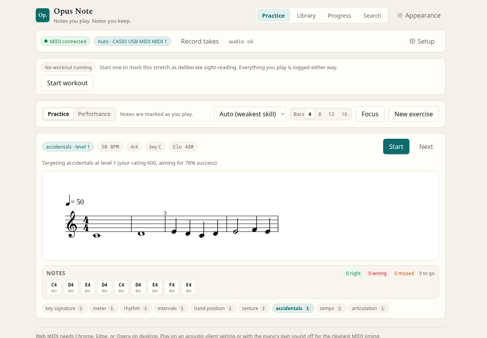
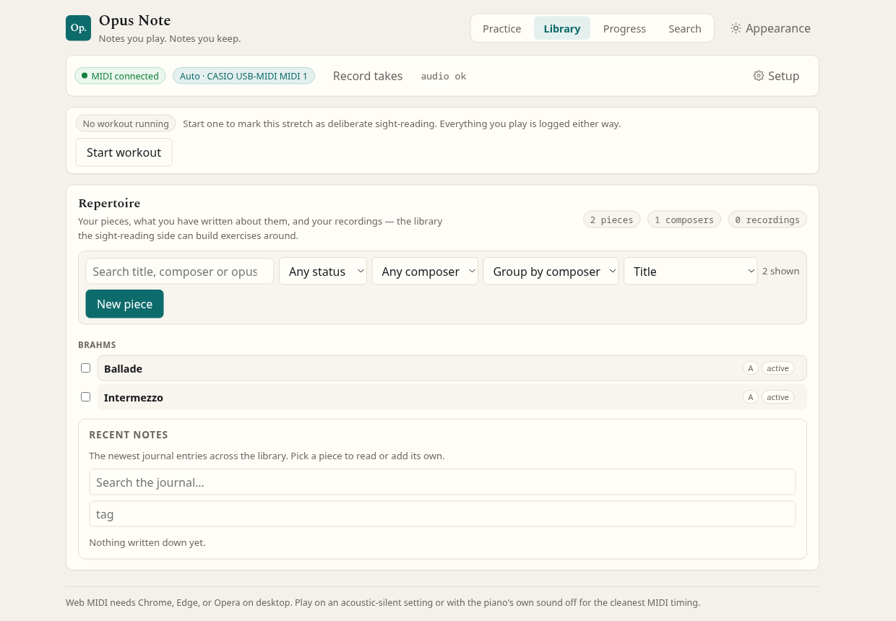
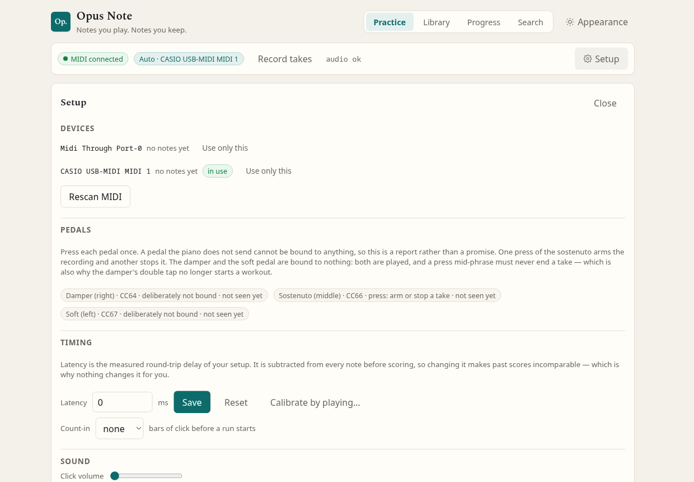
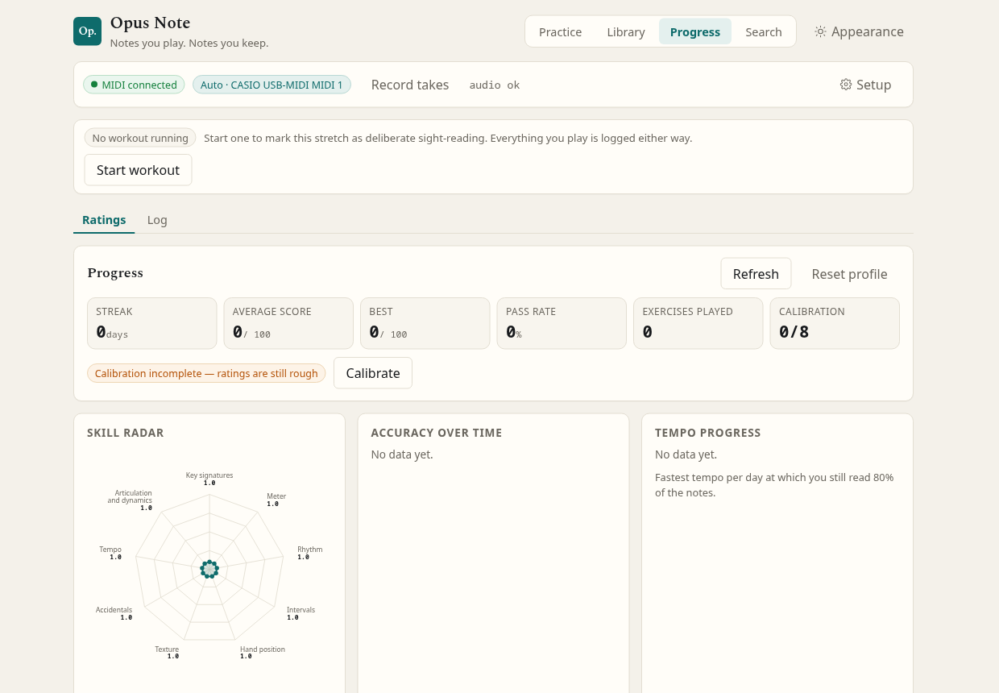
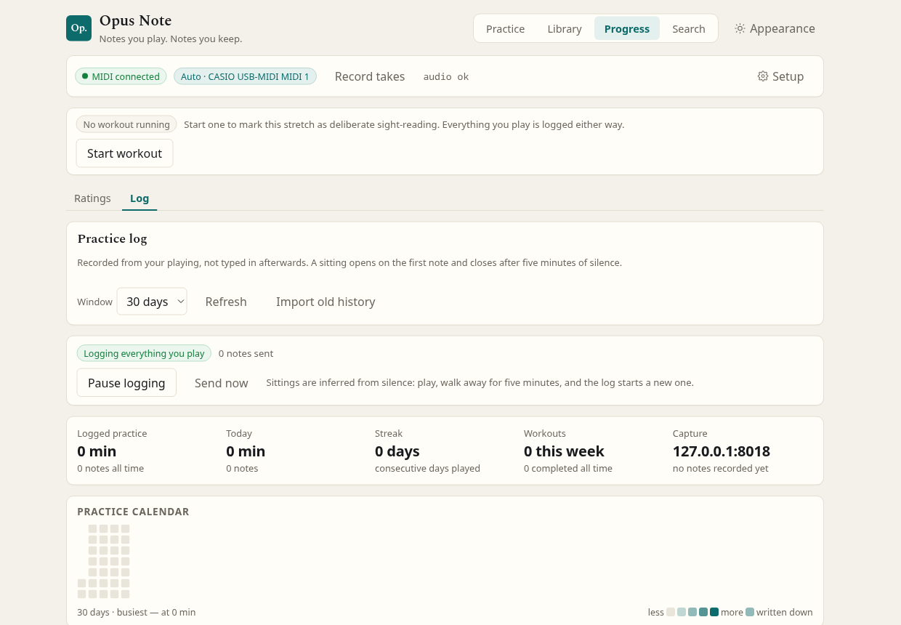

# Opus Note

[](https://github.com/Marco-Normal/OpusNote/actions/workflows/ci.yml)
[](LICENSE)

**Notes you play. Notes you keep.**

An adaptive sight-reading coach and practice journal for a real acoustic piano. Opus Note
engraves a short, level-appropriate excerpt, counts the player in over a metronome, listens to a
MIDI keyboard, and scores pitch, rhythm and continuity. Between exercises it logs everything
played, keeps a library of repertoire with journal notes, scores and recordings, and reports how
both halves are progressing.

Built for a **Casio PX-870** over USB, and compatible with any class-compliant MIDI keyboard.
Python 3.11 / FastAPI / SQLite / music21 on the server; Svelte 5 / TypeScript / Vite in the
browser.



*An exercise with the adaptive rationale, expected-note timeline and per-hand attribution.*

---

## Contents

- [Overview](#overview)
- [How this was built](#how-this-was-built)
- [Screenshots](#screenshots)
- [Architecture](#architecture)
- [Quick start](#quick-start)
- [The adaptive engine](#the-adaptive-engine)
- [Verification](#verification)
- [Project layout](#project-layout)
- [Documentation](#documentation)
- [Limitations](#limitations)
- [Credits and licence](#credits-and-licence)

---

## Overview

The application is organised around three sections:

| Section | Purpose |
| --- | --- |
| **Practice** | Adaptive sight-reading exercises, scored and calibrated to the player |
| **Library** | Repertoire, journal entries, passages, scores, recordings and recorded takes |
| **Progress** | Rating history, practice statistics, and the practice log |

A **Setup** panel holds device, audio and timing configuration, so the interface itself stays
focused on playing.

Selected capabilities:

- **Adaptive difficulty across nine independent skills.** Elo-based, with the selector aiming
  below the player's rating so that success lands in the 70–85% band rather than at 50%.
- **Score generation, not a fixed exercise set.** Exercises are composed from the skill levels
  via music21 and served as MusicXML, including a left-hand accompaniment library of 18 named
  figures from Alberti bass to canon.
- **Real-time scoring against the notation** — pitch, rhythm and continuity, reported per hand,
  with configurable thresholds.
- **Passive practice logging.** Notes are captured continuously and grouped into sittings and
  segments; no button press is required. Boundaries follow the passage rather than a fixed clock:
  a pause counts when it is long *for what you were playing*, a stray touch is not its own segment,
  and a long stretch is split at its own internal pauses.
- **The log shows what you actually did.** Adjacent attempts at the same material are grouped into
  a **passage** — "six goes at this bit" is one row with its attempts beneath it, not six — under a
  heading naming the piece that stretch of the sitting was about. Labelling a passage labels every
  attempt in it, so a session of drilling is a handful of decisions rather than one per pause.
- **Piece recognition.** Hand-tagged segments become training data, and the matcher offers the
  piece it believes was played, with a way to disagree. It compares *local content* — the notes,
  chords and melodic shapes themselves — not a whole-segment average, so a drill that is a snippet
  of a piece still matches it, a slower repeat is still the same passage, and the answer does not
  get worse as the library grows.
- **An edit can be taken back.** Splitting, merging and re-tagging a segment are reversible: after
  any of them the timeline offers *Undo split*, *Undo merge* or *Undo label*, and it works by
  reversing that one change exactly. The offer lasts until the page is reloaded, and re-segmenting
  is the exception — it throws every boundary away and rebuilds them, so it says so before it runs.
- **The streak forgives one rest day a week.** A single missed day does not end it, the dashboard
  says when a rest day is being counted, and two missed days inside the same week do. Today not
  being played yet never counts against you. The week review also names your target —
  *"on 3 of 4 target days"* — which is a preference rather than a score.
- **Workouts, declared rather than inferred.** *Start workout* … *Finish workout* marks the window on
  purpose; everything played inside it is labelled deliberate sight-reading rather than mistaken for
  ordinary practice, and the log separates "how long did I play" from "how much deliberate
  sight-reading did I do". A workout can be started from any section.
- **Repertoire management** with a journal, tagged and rated, alongside scores (PDF and
  MusicXML) and recordings with waveform A/B loops.
- **Playback** through the piano itself, a sampled Yamaha C5, or a synthesiser, with a
  piano-roll view and speed-reduced take comparison.
- **Offline-first operation.** The sampler is fetched once and served locally; nothing at play
  time touches the network.

## How this was built

This project was developed **with AI assistance, under my direction**. I set the goals and made
the product and architectural decisions; much of the code was written by AI agents working from
written plans, and I reviewed and verified the result. The unedited record is in this
repository: [`AGENT-LOG.md`](AGENT-LOG.md) is the session log, and `docs/PLAN-*.md` are the plans
the work was carried out from.

That is stated plainly here for two reasons. It is true, and it is visible — anyone reading this
repository will find the log anyway, and finding it unmentioned would be worse than finding it
explained. And it is the genuinely interesting part of the project. Generating code was never the
constraint; **deciding what to build and refusing to trust a green tick** was. An AI will
cheerfully produce code and tests that agree with each other and are both wrong.

So the discipline that made this work is verification, and it is the part worth looking at:

- **[59 falsification scripts](backend/tools/falsifications)** each break the production code
  deliberately, to prove that an assertion can actually fail. A test that cannot fail is not a
  test, and a suite of them is a green light over nothing.
- **[docs/TEST-STRATEGY.md](docs/TEST-STRATEGY.md)** records the suite being graded rather than
  assumed, including the assertions that were found to be incapable of failing and the ones that
  passed while the feature was broken.
- **[docs/PLAN-OPUS-NOTE-IDENTITY.md](docs/PLAN-OPUS-NOTE-IDENTITY.md)** §6 records four places
  where the written plan was wrong and the code was right, and one verification tier
  deliberately not run — the kind of thing that is easy to quietly drop.

The interesting claim is not that an AI wrote a piano app. It is that a plan can be held to
evidence, and that "it passes" can be made to mean something.

## Screenshots

| | |
| --- | --- |
|  |  |
| The library: pieces grouped by composer, with the journal feed | Setup: devices, pedals, timing, sound and capture in one place |

| | |
| --- | --- |
|  |  |
| Progress: rating history and the skill radar | The practice log: sittings, segments and time spent |

## Architecture

| Layer | Location | Responsibility |
| --- | --- | --- |
| Client | `frontend/src` | Render notation, capture MIDI, run the metronome, display feedback |
| API | `backend/app/` | Serve exercises as MusicXML, score performances, and own the library, practice log, workouts, backup and device status |
| Storage | `backend/app/*/store.py` + SQLite | One database, one owner per domain: `practice/`, `repertoire/`, `workout/`, plus `store.py` for profiles, skills and attempts |

The client makes **no musical judgements of its own**; every score comes from the API. The practice
loop turns on two endpoints — `GET /api/exercise/next` returns MusicXML plus the expected-note
timeline, and `POST /api/score` takes played notes and returns per-note feedback with sub-scores —
while the log, library and workouts are served by their own routers under `/api/practice`,
`/api/repertoire` and `/api/workout`. Keeping the generator and the scorer behind `/api` is what
makes them replaceable without touching the browser.

See [docs/ENGINEERING.md](docs/ENGINEERING.md) for the difficulty model, the adaptive engine,
the scorer and the timing model.

## Quick start

**Prerequisites:** Python 3.11, Node 23.6+ (the frontend units are TypeScript run directly by
`node --test`, which older Node cannot load), and a Chromium-based browser. Web MIDI requires Chrome,
Edge or Opera on desktop; the interface detects unsupported browsers and reports this rather
than failing silently.

Two processes: the API and the browser client.

```bash
# 1. API
cd backend
python3.11 -m venv .venv
.venv/bin/pip install -r requirements.txt
.venv/bin/python -m uvicorn app.main:app --reload --port 8000

# 2. Client, in a second terminal
cd frontend
npm install
npm run dev
```

Open **http://localhost:5173** and click **Connect MIDI**. The application then selects the
keyboard automatically; open **Setup** to inspect the available inputs and what has been heard
from each.

> Use `localhost` rather than `127.0.0.1` for the development server — that is where Vite binds
> by default. Web MIDI requires a secure context, and `localhost` qualifies.

### Single-process mode

The API can serve the built client itself, which is how it is deployed and how the end-to-end
suite exercises it:

```bash
cd frontend && npm run build
cd ../backend && .venv/bin/python -m uvicorn app.main:app --port 8000
# Everything is served from http://127.0.0.1:8000
```

For installation as a service with a Chromium kiosk, see [docs/DEPLOYMENT.md](docs/DEPLOYMENT.md)
and [`deploy/README.md`](deploy/README.md).

## The adaptive engine

Nine independent skills, each rated on a 1–10 scale. The design detail worth stating is that a
learner's Elo is the difficulty at which they score 50%, so selecting exercises *at* that rating
would hold them at a 50% success rate. The selector therefore aims deliberately below it:

```
offset = 400 · log10(1/target − 1)      # target = 0.78  →  offset ≈ −220
```

A rating of 1000 receives exercises around Elo 780. A simulation in `backend/tests/test_adaptive.py`
walks a learner of fixed true ability and asserts that the served difficulty converges into the
70–85% band. Full derivation, including the choice of the base anchor, is in
[docs/ENGINEERING.md](docs/ENGINEERING.md) §4.

## Verification

`./check.sh` is the single entry point. It has four tiers, because a suite nobody runs is
decorative:

```bash
./check.sh --fast            # everything that must pass after every edit (budget: 180 s)
./check.sh --full            # the above plus coverage, the browser scenarios and mutation
./check.sh --falsify [filter]       # every break script, against the check it declares (~1 h)
./check.sh --falsify-quick [filter] # the same, minus the scripts whose check is the fast tier
```

| Tier | Scope |
| --- | --- |
| Backend | Unit and API integration tests (`pytest`) |
| Frontend | Pure modules under `node --test` |
| Typecheck and build | `svelte-check` and the production build |
| Deploy | The kiosk's managed Chromium policy, read by a plain-bash test |
| Browser end-to-end | 17 scenarios in real Chromium against a real server |
| Coverage and mutation | Reports only; not gates until their baselines are established |
| Falsification | Every break script, run against the assertion it claims to break — a check that passes with the break applied is a test that cannot fail |

The browser suite injects a **simulated Web MIDI device** before any page script runs, so the
genuine MIDI input path — status-byte decoding, input selection, and onset measurement against
the count-in anchor — is exercised rather than stubbed. It plays a correct performance, a wrong
one and a silent one, walks a calibration rung, and asserts on the rendered notation, the results
panel and the progress view. Individual scenarios can be run in isolation during development:

```bash
backend/tools/run_e2e.sh playback     # one scenario, by name
backend/tools/run_e2e.sh              # every scenario
```

What each tier must cover is owned by [docs/TEST-STRATEGY.md](docs/TEST-STRATEGY.md). What a change
owes the *documentation* — which file, and in which commit — is owned by
[docs/ECOSYSTEM.md](docs/ECOSYSTEM.md) § *The standing rule for documentation*.

## Project layout

```
backend/
  app/
    main.py            FastAPI application — the practice loop's HTTP layer
    services.py        Orchestration: generate, score, adapt, persist
    db.py              Schema, connection handling, migrations
    models.py          Request/response schemas
    skills_data.py     The difficulty model (single source of truth)
    config.py          Every tunable, environment-overridable
    backup.py          JSON export and import           (/api/backup)
    hostinfo.py        ALSA / MIDI device status        (/api/host)
    piano.py           One-time sampled-piano download  (/api/audio)
    bridge.py          piano-progress import bridge
    music/             Skill levels → music21 score, and score → expected timeline
      generator.py  expected.py  events.py  harmony.py  melody.py  tonality.py  bass_patterns.py
    scoring/engine.py  Pitch / rhythm / continuity
    adaptive/          elo.py  selector.py
    practice/          Passive logging, segmentation, recognition, metrics, pedal
    repertoire/        Pieces, journal, passages, media, takes, importer
    workout/           Declared workouts: api.py  store.py  schema.py  models.py
  tests/               Unit, API, migration, contract and seam tests
  tools/
    e2e_browser.py     Real-browser end-to-end verification
    run_e2e.sh         Start a server and run the scenarios
    falsify.sh         Prove an assertion can fail, or refuse to claim it did
    falsifications/    One break script per guarded assertion
    measure_autotag.py How well the matcher performs on drill-shaped practice
    measure_real.py    The same, against the real local fixture
frontend/
  src/
    app.css            Design tokens — colour, type, shape (single source)
    App.svelte         Shell, navigation, keyboard shortcuts, workout banner
    main.ts            Mount point
    lib/               API, MIDI, metronome, scoring display, live matching, state
    components/        Practice, Library, Progress, Setup, charts, timeline
    assets/fonts/      The bundled notation font
docs/                  Reference, decisions, verification and plans
deploy/                systemd units, kiosk policy, installer
```

## Documentation

**Reference** — what the application does and how it is built.

| Document | Contents |
| --- | --- |
| [docs/FEATURES.md](docs/FEATURES.md) | Detailed behaviour of every feature |
| [docs/ENGINEERING.md](docs/ENGINEERING.md) | Architecture, API contract, difficulty model, adaptive engine, scorer, timing, configuration, known limitations |
| [docs/DEPLOYMENT.md](docs/DEPLOYMENT.md) | Running on the piano machine, the LAN server, backup, moving between machines |
| [deploy/README.md](deploy/README.md) | The install checklist: systemd service, kiosk, MIDI permission policy |
| [THIRD-PARTY.md](THIRD-PARTY.md) | Licence notices for bundled, vendored and installed components |

**Decisions and direction** — why the application is shaped the way it is.

| Document | Contents |
| --- | --- |
| [docs/ECOSYSTEM.md](docs/ECOSYSTEM.md) | The target architecture, the phase plan, and the decision record for every phase |
| [docs/ROADMAP.md](docs/ROADMAP.md) | The original slice roadmap — **superseded** by ECOSYSTEM; kept for its reasoning |
| [docs/INTEGRATION-practice-logger.md](docs/INTEGRATION-practice-logger.md) | The original two-project integration proposal — **superseded**; kept for what it verified |

**Verification** — how a change is known not to have broken something.

| Document | Contents |
| --- | --- |
| [docs/TEST-STRATEGY.md](docs/TEST-STRATEGY.md) | What the tests must cover, the tiers they belong to, and the standing rule that no assertion is trusted until it has been seen to fail |
| [docs/TEST-DATA.md](docs/TEST-DATA.md) | The local-only fixture of real practice data, and the trap it holds |
| [check.sh](check.sh) | The single verification entry point (`--fast`, `--full`, `--falsify`, `--falsify-quick`) |

**Plans for landed work** — implementation records, not open work.

| Document | Contents |
| --- | --- |
| [docs/PLAN-PHASE8-9.md](docs/PLAN-PHASE8-9.md) | MIDI that sets itself up, and the LAN server — landed |
| [docs/PLAN-PHASE20A.md](docs/PLAN-PHASE20A.md) … [20E](docs/PLAN-PHASE20E.md) | Deliberate practice, piano-side ergonomics, log trust, journal depth, audio takes — landed |
| [docs/PLAN-PHASE21.md](docs/PLAN-PHASE21.md), [docs/PLAN-PHASE22.md](docs/PLAN-PHASE22.md) | The blur and the edit path; hearing the piece — landed |
| [docs/PLAN-PHASE23.md](docs/PLAN-PHASE23.md) | The pedal as a quick-action surface: three configurable gestures on the sostenuto, and a review flag — landed |
| [docs/PLAN-OPUS-NOTE-IDENTITY.md](docs/PLAN-OPUS-NOTE-IDENTITY.md) | The rename, the visual identity and the navigation declutter |
| [docs/PLAN-SLICE0.md](docs/PLAN-SLICE0.md), [docs/PLAN-SLICE1.md](docs/PLAN-SLICE1.md) | Slices 0 and 1 of the test strategy — landed |

**Open work** — the only plan in this tree that describes anything not yet done.

| Document | Contents |
| --- | --- |
| [docs/PLAN-SLICES1-7.md](docs/PLAN-SLICES1-7.md) | Slices 2-7 of the test strategy — **stalled after Slice 1**; `docs/TESTING.md` (Slice 8) is not yet written |

**The record.**

| Document | Contents |
| --- | --- |
| [AGENT-LOG.md](AGENT-LOG.md) | The append-only shared log: what each agent did, and why |

## Limitations

- **Personal project, single-user by design.** There is no authentication; one local profile is
  assumed. `POST /api/profile/reset` clears it.
- **Generated music is generated music.** It is musical and correctly notated, but a curated
  library can be substituted behind the same API.
- **Polyphony is approximated at the top of the range.** Textures 7–10 are deliberate
  simplifications; scoring handles them correctly, but only the composition is simplified.
- **Tempo is constant within an exercise**, which keeps the beat grid exact.
- **Desktop only.** Web MIDI is not available in Safari or Firefox, and the interface reports
  this rather than failing quietly.
- **Startup cost.** Importing music21 takes a second or two; exercise generation itself is on
  the order of 20 ms.

## Credits and licence

Opus Note is released under the [MIT License](LICENSE). Third-party components and assets remain
under their own licenses; the full notices are in [THIRD-PARTY.md](THIRD-PARTY.md).

| Work | Licence |
| --- | --- |
| Opus Note source code | MIT |
| [OpenSheetMusicDisplay](https://github.com/opensheetmusicdisplay/opensheetmusicdisplay) — MusicXML engraving in the browser | BSD-3-Clause |
| [VexFlow](https://github.com/vexflow/vexflow) — notation primitives, via OpenSheetMusicDisplay | MIT |
| [Tone.js](https://tonejs.github.io/) — Web Audio scheduling and the synthesiser voice | MIT |
| [JSZip](https://stuk.github.io/jszip/) — compressed MusicXML, used under the MIT option | MIT |
| [Svelte](https://svelte.dev/) — the client framework | MIT |
| [music21](https://web.mit.edu/music21/) — score construction and manipulation on the server | BSD-3-Clause |
| **Spectral** by Production Type — the display face, self-hosted so no request leaves the machine | [SIL OFL 1.1](frontend/src/assets/fonts/OFL.txt) |
| **Salamander Grand Piano V3** by Alexander Holm — the optional 30-sample instrument, fetched once and then served locally | [CC BY 3.0](https://creativecommons.org/licenses/by/3.0/) |

The sampled piano is not committed to this repository: it is downloaded from
`tonejs.github.io` on request and cached on the local machine, with the attribution above shown in
the interface beside the download control.
